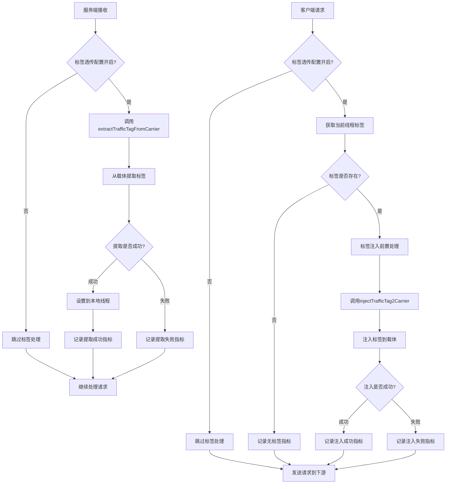
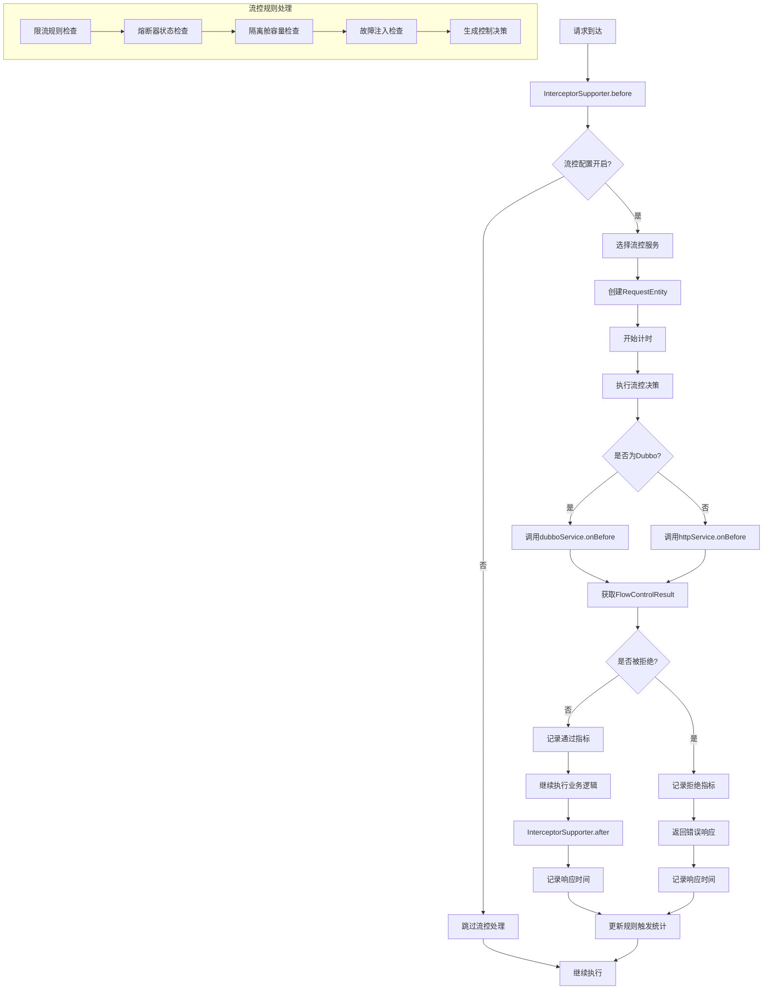

# Sermant 插件指标服务接入设计文档

## 1. 概述

### 1.1 背景
Sermant 框架层已实现指标服务，目前路由插件已成功接入。为了更好地监控 Sermant 内部行为，需要将标签透传插件和流控插件接入到指标服务中，实现对这些核心插件的监控和可观测性。

### 1.2 目标
- 为标签透传插件实现指标采集、存储与上报
- 为流控插件实现指标采集、存储与上报
- 确保指标设计与现有路由插件保持一致
- 提供插件运行状态的全面监控能力

### 1.3 设计原则
- **一致性**: 与现有路由插件指标实现保持设计和命名一致
- **低侵入性**: 最小化对现有插件代码的修改
- **高性能**: 指标采集不影响插件核心功能性能（<5% 开销）
- **可扩展性**: 便于后续新增指标类型
- **可观测性**: 提供细粒度的监控数据用于故障排查和性能优化

## 2. 现有框架分析

### 2.1 框架层指标服务架构
```
框架层指标服务架构:
├── io.sermant.core.service.metric.api.MetricService (指标服务接口)
├── io.sermant.implement.service.metric.MeterMetricServiceImpl (具体实现)
├── 支持的指标类型:
│   ├── Counter (计数器)
│   ├── Gauge (仪表盘)
│   ├── Timer (定时器)
│   └── Summary (摘要)
└── 标签支持: Tags 和多维度标签
```

### 2.2 路由插件指标实现参考

路由插件通过 `MetricsManager` 类实现指标管理，主要特点：
- 使用 `ServiceManager.getService(MetricService.class)` 获取指标服务
- 通过 `Counter` 类型记录请求计数
- 使用标签区分不同的服务、协议和地址
- 支持指标开关控制

**核心指标**:
- `router_request_count`: 路由请求计数
- `router_destination_tag_count`: 目标标签计数
- `router_unmatched_request_count`: 未匹配请求计数
- `lane_tag_count`: 泳道标签计数

## 3. 标签透传插件指标设计

### 3.1 插件分析

标签透传插件架构：
- **核心功能**: 在不同协议间透传流量标签
- **拦截器分类**: 
  - `AbstractClientInterceptor`: 客户端拦截器（发送端）
  - `AbstractServerInterceptor`: 服务端拦截器（接收端）
- **支持协议**: HTTP、Dubbo、gRPC、RocketMQ、Kafka、Feign 等

### 3.2 指标需求识别

基于标签透传插件的核心功能，识别出以下关键指标：

#### 3.2.1 客户端指标
- **标签注入计数**: 记录客户端向下游注入标签的次数
- **标签注入失败计数**: 记录标签注入失败的次数
- **标签传输大小**: 记录传输标签的数据量

#### 3.2.2 服务端指标
- **标签提取计数**: 记录服务端从上游提取标签的次数
- **标签提取失败计数**: 记录标签提取失败的次数
- **标签覆盖计数**: 记录标签被覆盖的次数

#### 3.2.3 通用指标
- **协议分布统计**: 按协议统计标签透传次数
- **标签键值对计数**: 记录不同标签键的使用频率

### 3.3 标签透传插件执行流程图



### 3.4 详细指标定义

#### 3.4.1 基础计数指标

```yaml
指标名称: tag_transmission_operation_total
类型: Counter
描述: 标签透传操作总次数
标签:
  - protocol: 协议类型 (http/dubbo/grpc/rocketmq/kafka/feign/okhttp)
  - service_name: 服务名称
  - operation: 操作类型 (inject/extract)
  - status: 状态 (success/failure/skipped)
  - interceptor_type: 拦截器类型 (client/server)
```

#### 3.4.2 标签内容指标

```yaml
指标名称: tag_transmission_tag_total
类型: Counter  
描述: 标签键值对传输计数
标签:
  - tag_key: 标签键名
  - protocol: 协议类型
  - service_name: 服务名称
  - operation: 操作类型 (inject/extract)

指标名称: tag_transmission_tag_size_bytes
类型: Summary
描述: 单次传输标签数据大小分布
标签:
  - protocol: 协议类型
  - service_name: 服务名称
  - operation: 操作类型
量化值: 50%, 75%, 95%, 99%分位数, count, sum

指标名称: tag_transmission_tag_count_per_request
类型: Histogram
描述: 单次请求中标签数量分布
标签:
  - protocol: 协议类型
  - service_name: 服务名称
桶配置: [1, 2, 5, 10, 20, 50, 100]
```

#### 3.4.3 性能指标

```yaml
指标名称: tag_transmission_duration_seconds
类型: Timer
描述: 标签透传操作耗时
标签:
  - protocol: 协议类型
  - operation: 操作类型
  - service_name: 服务名称

指标名称: tag_transmission_config_enabled
类型: Gauge
描述: 标签透传配置状态 (0=disabled, 1=enabled)
标签:
  - service_name: 服务名称
```

#### 3.4.4 错误指标

```yaml
指标名称: tag_transmission_error_total
类型: Counter
描述: 标签透传错误计数
标签:
  - protocol: 协议类型
  - error_type: 错误类型 (parse_error/inject_error/extract_error/size_limit_exceeded)
  - service_name: 服务名称
  - operation: 操作类型
```

## 4. 流控插件指标设计

### 4.1 插件分析

流控插件架构：
- **核心功能**: 实现限流、熔断、隔离、重试等流量控制策略
- **主要拦截器**: 
  - `ApacheDubboInterceptor`: Dubbo 流控
  - `HttpRequestInterceptor`: HTTP 流控
  - `DispatcherServletInterceptor`: Servlet 流控
- **流控结果**: `FlowControlResult` 包含控制决策和响应信息

### 4.2 指标需求识别

基于流控插件的核心功能，识别出以下关键指标：

#### 4.2.1 流控执行指标
- **流控请求总数**: 记录经过流控处理的请求总数
- **流控拒绝计数**: 记录被流控拒绝的请求数
- **流控通过计数**: 记录通过流控的请求数

#### 4.2.2 流控类型指标
- **限流触发计数**: 记录限流规则触发次数
- **熔断触发计数**: 记录熔断器打开次数
- **隔离触发计数**: 记录隔离舱满载次数
- **重试执行计数**: 记录重试执行次数

#### 4.2.3 性能指标
- **流控响应时间**: 记录流控决策耗时
- **流控规则数量**: 记录当前生效的流控规则数量

### 4.3 流控插件执行流程图



### 4.4 详细指标定义

#### 4.4.1 基础流控指标

```yaml
指标名称: flowcontrol_request_total
类型: Counter
描述: 流控处理请求总数
标签:
  - service_name: 服务名称
  - method: 方法名
  - protocol: 协议类型 (http/dubbo/servlet)
  - result: 结果 (passed/rejected/error)
  - rule_type: 规则类型 (rate_limit/circuit_breaker/bulkhead/fault_injection)
  - flow_framework: 流控框架 (sentinel/resilience4j)

指标名称: flowcontrol_rule_triggered_total
类型: Counter
描述: 流控规则触发总次数
标签:
  - rule_name: 规则名称
  - rule_type: 规则类型
  - service_name: 服务名称
  - method: 方法名
  - action: 动作 (reject/degrade/isolate/delay)
  - framework: 流控框架类型
```

#### 4.4.2 性能指标

```yaml
指标名称: flowcontrol_decision_duration_seconds
类型: Timer
描述: 流控决策耗时
标签:
  - service_name: 服务名称
  - rule_type: 规则类型
  - protocol: 协议类型
  - result: 决策结果

指标名称: flowcontrol_request_duration_seconds
类型: Summary
描述: 请求处理时间分布
标签:
  - service_name: 服务名称
  - method: 方法名
  - result: 处理结果
量化值: 50%, 75%, 90%, 95%, 99%分位数
```

#### 4.4.3 规则状态指标

```yaml
指标名称: flowcontrol_active_rules
类型: Gauge
描述: 当前生效流控规则数量
标签:
  - rule_type: 规则类型
  - service_name: 服务名称
  - framework: 流控框架

指标名称: flowcontrol_circuit_breaker_state
类型: Gauge  
描述: 熔断器状态 (0=closed, 1=open, 2=half-open)
标签:
  - service_name: 服务名称
  - method: 方法名
  - circuit_breaker_name: 熔断器名称

指标名称: flowcontrol_bulkhead_available_permits
类型: Gauge
描述: 隔离舱可用许可数
标签:
  - service_name: 服务名称
  - bulkhead_name: 隔离舱名称
```

#### 4.4.4 限流指标

```yaml
指标名称: flowcontrol_rate_limit_permits_total
类型: Counter
描述: 限流器许可总数
标签:
  - service_name: 服务名称
  - method: 方法名
  - rate_limiter_name: 限流器名称
  - result: 结果 (acquired/rejected)

指标名称: flowcontrol_rate_limit_wait_duration_seconds
类型: Summary
描述: 限流等待时间分布
标签:
  - service_name: 服务名称
  - rate_limiter_name: 限流器名称
```

#### 4.4.5 重试指标

```yaml
指标名称: flowcontrol_retry_attempts_total
类型: Counter
描述: 重试尝试总次数
标签:
  - service_name: 服务名称
  - method: 方法名
  - retry_name: 重试策略名称
  - result: 结果 (success/failure/max_attempts_exceeded)

指标名称: flowcontrol_retry_delay_seconds
类型: Summary
描述: 重试延迟时间分布
标签:
  - service_name: 服务名称
  - retry_name: 重试策略名称
  - attempt_number: 重试次数
```

#### 4.4.6 错误指标

```yaml
指标名称: flowcontrol_error_total
类型: Counter
描述: 流控处理错误总数
标签:
  - service_name: 服务名称
  - error_type: 错误类型 (config_error/rule_parse_error/execution_error)
  - rule_type: 规则类型
  - component: 组件名称
```

## 5. 技术方案

### 5.1 实现架构

```
插件指标实现架构:
├── 标签透传插件
│   ├── TagTransmissionMetricsManager (指标管理器)
│   ├── TagTransmissionMetricInfo (指标信息封装)
│   └── 集成点: AbstractClientInterceptor & AbstractServerInterceptor
└── 流控插件  
    ├── FlowControlMetricsManager (指标管理器)
    ├── FlowControlMetricInfo (指标信息封装)
    └── 集成点: InterceptorSupporter & FlowControlResult
```

### 5.2 代码实现方案

#### 5.2.1 指标管理器设计

参考路由插件的 `MetricsManager`，为每个插件实现独立的指标管理器：

```java
/**
 * 标签透传指标管理器
 */
public class TagTransmissionMetricsManager {
    private static final Logger LOGGER = LoggerFactory.getLogger();
    private static final Map<MetricInfo, Counter> COUNTER_MAP = new ConcurrentHashMap<>();
    private static final Map<MetricInfo, Timer> TIMER_MAP = new ConcurrentHashMap<>();
    private static final Map<MetricInfo, Summary> SUMMARY_MAP = new ConcurrentHashMap<>();
    private static final Map<MetricInfo, Gauge> GAUGE_MAP = new ConcurrentHashMap<>();
    
    private static MetricService metricService = null;
    private static TagTransmissionConfig config = null;
    
    static {
        try {
            metricService = ServiceManager.getService(MetricService.class);
            config = PluginConfigManager.getPluginConfig(TagTransmissionConfig.class);
        } catch (IllegalArgumentException e) {
            LOGGER.log(Level.SEVERE, "Failed to load metrics service", e);
        }
    }
    
    /**
     * 记录标签透传操作指标
     */
    public static void recordOperation(String protocol, String serviceName, 
                                     String operation, String status, String interceptorType) {
        if (!isMetricsEnabled()) {
            return;
        }
        
        Map<String, String> tags = createBaseTags(protocol, serviceName);
        tags.put("operation", operation);
        tags.put("status", status);
        tags.put("interceptor_type", interceptorType);
        
        incrementCounter("tag_transmission_operation_total", tags);
    }
    
    /**
     * 记录标签内容指标
     */
    public static void recordTagContent(String protocol, String serviceName, 
                                      String operation, String tagKey) {
        if (!isMetricsEnabled()) {
            return;
        }
        
        Map<String, String> tags = createBaseTags(protocol, serviceName);
        tags.put("operation", operation);
        tags.put("tag_key", tagKey);
        
        incrementCounter("tag_transmission_tag_total", tags);
    }
    
    /**
     * 记录标签数据大小
     */
    public static void recordTagSize(String protocol, String serviceName, 
                                   String operation, int sizeBytes) {
        if (!isMetricsEnabled()) {
            return;
        }
        
        Map<String, String> tags = createBaseTags(protocol, serviceName);
        tags.put("operation", operation);
        
        recordSummary("tag_transmission_tag_size_bytes", tags, sizeBytes);
    }
    
    /**
     * 开始计时操作
     */
    public static Timer.Sample startTimer(String protocol, String operation, String serviceName) {
        if (!isMetricsEnabled()) {
            return null;
        }
        
        Map<String, String> tags = createBaseTags(protocol, serviceName);
        tags.put("operation", operation);
        
        Timer timer = getOrCreateTimer("tag_transmission_duration_seconds", tags);
        return timer.start();
    }
    
    /**
     * 记录错误指标
     */
    public static void recordError(String protocol, String serviceName, 
                                 String operation, String errorType) {
        if (!isMetricsEnabled()) {
            return;
        }
        
        Map<String, String> tags = createBaseTags(protocol, serviceName);
        tags.put("operation", operation);
        tags.put("error_type", errorType);
        
        incrementCounter("tag_transmission_error_total", tags);
    }
    
    /**
     * 更新配置状态指标
     */
    public static void updateConfigStatus(String serviceName, boolean enabled) {
        if (metricService == null) {
            return;
        }
        
        Map<String, String> tags = new HashMap<>();
        tags.put("service_name", serviceName);
        
        setGauge("tag_transmission_config_enabled", tags, enabled ? 1 : 0);
    }
    
    // 私有辅助方法
    private static boolean isMetricsEnabled() {
        return metricService != null && config != null && config.isEffect();
    }
    
    private static Map<String, String> createBaseTags(String protocol, String serviceName) {
        Map<String, String> tags = new HashMap<>();
        tags.put("protocol", protocol);
        tags.put("service_name", serviceName);
        return tags;
    }
    
    private static void incrementCounter(String metricName, Map<String, String> tags) {
        Counter counter = COUNTER_MAP.computeIfAbsent(
            new MetricInfo(metricName, tags),
            info -> metricService.counter(metricName, Tags.of(tags).addScope("tag-transmission"))
        );
        counter.increment();
    }
    
    private static void recordSummary(String metricName, Map<String, String> tags, double value) {
        Summary summary = SUMMARY_MAP.computeIfAbsent(
            new MetricInfo(metricName, tags),
            info -> metricService.summary(metricName, Tags.of(tags).addScope("tag-transmission"))
        );
        summary.record(value);
    }
    
    private static Timer getOrCreateTimer(String metricName, Map<String, String> tags) {
        return TIMER_MAP.computeIfAbsent(
            new MetricInfo(metricName, tags),
            info -> metricService.timer(metricName, Tags.of(tags).addScope("tag-transmission"))
        );
    }
    
    private static void setGauge(String metricName, Map<String, String> tags, double value) {
        // Gauge 需要特殊处理，因为它是状态指标
        metricService.gauge(metricName, Tags.of(tags).addScope("tag-transmission"))
                   .set(value);
    }
}

/**
 * 流控指标管理器  
 */
public class FlowControlMetricsManager {
    private static final Logger LOGGER = LoggerFactory.getLogger();
    private static final Map<MetricInfo, Counter> COUNTER_MAP = new ConcurrentHashMap<>();
    private static final Map<MetricInfo, Timer> TIMER_MAP = new ConcurrentHashMap<>();
    private static final Map<MetricInfo, Summary> SUMMARY_MAP = new ConcurrentHashMap<>();
    private static final Map<MetricInfo, Gauge> GAUGE_MAP = new ConcurrentHashMap<>();
    
    private static MetricService metricService = null;
    private static FlowControlConfig config = null;
    
    static {
        try {
            metricService = ServiceManager.getService(MetricService.class);
            config = PluginConfigManager.getPluginConfig(FlowControlConfig.class);
        } catch (IllegalArgumentException e) {
            LOGGER.log(Level.SEVERE, "Failed to load metrics service", e);
        }
    }
    
    /**
     * 记录流控请求指标
     */
    public static void recordRequest(String serviceName, String method, String protocol, 
                                   String result, String ruleType, String framework) {
        if (!isMetricsEnabled()) {
            return;
        }
        
        Map<String, String> tags = new HashMap<>();
        tags.put("service_name", serviceName);
        tags.put("method", method);
        tags.put("protocol", protocol);
        tags.put("result", result);
        tags.put("rule_type", ruleType);
        tags.put("flow_framework", framework);
        
        incrementCounter("flowcontrol_request_total", tags);
    }
    
    /**
     * 记录规则触发指标
     */
    public static void recordRuleTriggered(String ruleName, String ruleType, 
                                         String serviceName, String method, 
                                         String action, String framework) {
        if (!isMetricsEnabled()) {
            return;
        }
        
        Map<String, String> tags = new HashMap<>();
        tags.put("rule_name", ruleName);
        tags.put("rule_type", ruleType);
        tags.put("service_name", serviceName);
        tags.put("method", method);
        tags.put("action", action);
        tags.put("framework", framework);
        
        incrementCounter("flowcontrol_rule_triggered_total", tags);
    }
    
    /**
     * 开始流控决策计时
     */
    public static Timer.Sample startDecisionTimer(String serviceName, String ruleType, 
                                                 String protocol, String result) {
        if (!isMetricsEnabled()) {
            return null;
        }
        
        Map<String, String> tags = new HashMap<>();
        tags.put("service_name", serviceName);
        tags.put("rule_type", ruleType);
        tags.put("protocol", protocol);
        tags.put("result", result);
        
        Timer timer = getOrCreateTimer("flowcontrol_decision_duration_seconds", tags);
        return timer.start();
    }
    
    /**
     * 记录请求处理时间
     */
    public static void recordRequestDuration(String serviceName, String method, 
                                           String result, double durationSeconds) {
        if (!isMetricsEnabled()) {
            return;
        }
        
        Map<String, String> tags = new HashMap<>();
        tags.put("service_name", serviceName);
        tags.put("method", method);
        tags.put("result", result);
        
        recordSummary("flowcontrol_request_duration_seconds", tags, durationSeconds);
    }
    
    /**
     * 更新活跃规则数量
     */
    public static void updateActiveRules(String ruleType, String serviceName, 
                                       String framework, int count) {
        if (!isMetricsEnabled()) {
            return;
        }
        
        Map<String, String> tags = new HashMap<>();
        tags.put("rule_type", ruleType);
        tags.put("service_name", serviceName);
        tags.put("framework", framework);
        
        setGauge("flowcontrol_active_rules", tags, count);
    }
    
    /**
     * 更新熔断器状态
     */
    public static void updateCircuitBreakerState(String serviceName, String method, 
                                                String circuitBreakerName, int state) {
        if (!isMetricsEnabled()) {
            return;
        }
        
        Map<String, String> tags = new HashMap<>();
        tags.put("service_name", serviceName);
        tags.put("method", method);
        tags.put("circuit_breaker_name", circuitBreakerName);
        
        setGauge("flowcontrol_circuit_breaker_state", tags, state);
    }
    
    /**
     * 记录错误指标
     */
    public static void recordError(String serviceName, String errorType, 
                                 String ruleType, String component) {
        if (!isMetricsEnabled()) {
            return;
        }
        
        Map<String, String> tags = new HashMap<>();
        tags.put("service_name", serviceName);
        tags.put("error_type", errorType);
        tags.put("rule_type", ruleType);
        tags.put("component", component);
        
        incrementCounter("flowcontrol_error_total", tags);
    }
    
    // 私有辅助方法（与标签透传类似的实现）
    private static boolean isMetricsEnabled() {
        return metricService != null && config != null;
    }
    
    // ... 其他辅助方法实现类似
}
```

#### 5.2.2 标签透传插件集成实现

**1. AbstractClientInterceptor 集成**

```java
public abstract class AbstractClientInterceptor<C> extends AbstractInterceptor {
    // ... 现有代码 ...
    
    @Override
    public ExecuteContext before(ExecuteContext context) {
        String serviceName = AppCache.INSTANCE.getAppName();
        String protocol = getProtocolName();
        Timer.Sample timerSample = null;
        
        if (!tagTransmissionConfig.isEffect()) {
            TagTransmissionMetricsManager.recordOperation(protocol, serviceName, 
                "inject", "skipped", "client");
            return context;
        }

        TrafficTag trafficTag = TrafficUtils.getTrafficTag();
        if (trafficTag == null || MapUtils.isEmpty(trafficTag.getTag())) {
            TagTransmissionMetricsManager.recordOperation(protocol, serviceName, 
                "inject", "no_tags", "client");
            return context;
        }

        // 开始计时
        timerSample = TagTransmissionMetricsManager.startTimer(protocol, "inject", serviceName);
        
        try {
            // 执行标签注入
            ExecuteContext result = doBefore(context);
            
            // 记录成功指标
            TagTransmissionMetricsManager.recordOperation(protocol, serviceName, 
                "inject", "success", "client");
            
            // 记录标签内容指标
            for (String tagKey : trafficTag.getTag().keySet()) {
                TagTransmissionMetricsManager.recordTagContent(protocol, serviceName, 
                    "inject", tagKey);
            }
            
            // 记录标签数据大小
            int tagSize = calculateTagSize(trafficTag);
            TagTransmissionMetricsManager.recordTagSize(protocol, serviceName, 
                "inject", tagSize);
            
            return result;
        } catch (Exception e) {
            // 记录失败指标
            TagTransmissionMetricsManager.recordOperation(protocol, serviceName, 
                "inject", "failure", "client");
            TagTransmissionMetricsManager.recordError(protocol, serviceName, 
                "inject", "inject_error");
            throw e;
        } finally {
            // 停止计时
            if (timerSample != null) {
                timerSample.stop();
            }
        }
    }
    
    /**
     * 计算标签数据大小
     */
    protected int calculateTagSize(TrafficTag trafficTag) {
        int size = 0;
        for (Map.Entry<String, List<String>> entry : trafficTag.getTag().entrySet()) {
            size += entry.getKey().getBytes(StandardCharsets.UTF_8).length;
            if (entry.getValue() != null) {
                for (String value : entry.getValue()) {
                    if (value != null) {
                        size += value.getBytes(StandardCharsets.UTF_8).length;
                    }
                }
            }
        }
        return size;
    }
    
    /**
     * 获取协议名称 - 子类实现
     */
    protected abstract String getProtocolName();
}
```

**2. AbstractServerInterceptor 集成**

```java
public abstract class AbstractServerInterceptor<C> extends AbstractInterceptor {
    // ... 现有代码 ...
    
    @Override
    public ExecuteContext before(ExecuteContext context) {
        String serviceName = AppCache.INSTANCE.getAppName();
        String protocol = getProtocolName();
        Timer.Sample timerSample = null;
        
        if (!tagTransmissionConfig.isEffect()) {
            TagTransmissionMetricsManager.recordOperation(protocol, serviceName, 
                "extract", "skipped", "server");
            return context;
        }
        
        // 开始计时
        timerSample = TagTransmissionMetricsManager.startTimer(protocol, "extract", serviceName);
        
        try {
            // 执行标签提取
            ExecuteContext result = doBefore(context);
            
            // 检查提取结果
            TrafficTag extractedTag = TrafficUtils.getTrafficTag();
            if (extractedTag != null && !MapUtils.isEmpty(extractedTag.getTag())) {
                // 记录成功指标
                TagTransmissionMetricsManager.recordOperation(protocol, serviceName, 
                    "extract", "success", "server");
                
                // 记录标签内容指标
                for (String tagKey : extractedTag.getTag().keySet()) {
                    TagTransmissionMetricsManager.recordTagContent(protocol, serviceName, 
                        "extract", tagKey);
                }
                
                // 记录标签数据大小
                int tagSize = calculateTagSize(extractedTag);
                TagTransmissionMetricsManager.recordTagSize(protocol, serviceName, 
                    "extract", tagSize);
            } else {
                TagTransmissionMetricsManager.recordOperation(protocol, serviceName, 
                    "extract", "no_tags", "server");
            }
            
            return result;
        } catch (Exception e) {
            // 记录失败指标
            TagTransmissionMetricsManager.recordOperation(protocol, serviceName, 
                "extract", "failure", "server");
            TagTransmissionMetricsManager.recordError(protocol, serviceName, 
                "extract", "extract_error");
            throw e;
        } finally {
            // 停止计时
            if (timerSample != null) {
                timerSample.stop();
            }
        }
    }
    
    protected abstract String getProtocolName();
}
```

#### 5.2.3 流控插件集成实现

**1. InterceptorSupporter 基类集成**

```java
public abstract class InterceptorSupporter extends ReflectMethodCacheSupport implements Interceptor {
    // ... 现有代码 ...
    
    @Override
    public ExecuteContext before(ExecuteContext context) throws Exception {
        if (!canInvoke(context)) {
            return context;
        }
        
        String serviceName = getServiceName(context);
        String method = getMethodName(context);
        String protocol = getProtocol();
        Timer.Sample decisionTimer = null;
        
        try {
            // 开始流控决策计时
            decisionTimer = FlowControlMetricsManager.startDecisionTimer(serviceName, 
                "all", protocol, "unknown");
            
            // 执行原有的 doBefore 逻辑
            ExecuteContext result = doBefore(context);
            
            // 从 context 中获取流控结果（如果存在）
            FlowControlResult flowControlResult = getFlowControlResult(context);
            if (flowControlResult != null) {
                String resultStatus = flowControlResult.isSkip() ? "rejected" : "passed";
                String ruleType = determineRuleType(flowControlResult);
                
                // 记录流控请求指标
                FlowControlMetricsManager.recordRequest(serviceName, method, protocol, 
                    resultStatus, ruleType, getFlowFramework());
                
                // 如果被拒绝，记录规则触发指标
                if (flowControlResult.isSkip()) {
                    FlowControlMetricsManager.recordRuleTriggered("unknown", ruleType, 
                        serviceName, method, "reject", getFlowFramework());
                }
            }
            
            return result;
        } catch (Exception e) {
            // 记录错误指标
            FlowControlMetricsManager.recordError(serviceName, "execution_error", 
                "unknown", getClass().getSimpleName());
            throw e;
        } finally {
            // 停止决策计时
            if (decisionTimer != null) {
                decisionTimer.stop();
            }
        }
    }
    
    @Override
    public ExecuteContext after(ExecuteContext context) throws Exception {
        if (!canInvoke(context)) {
            return context;
        }
        
        try {
            return doAfter(context);
        } finally {
            // 记录请求处理时间（如果有记录开始时间）
            Long startTime = getRequestStartTime(context);
            if (startTime != null) {
                double duration = (System.currentTimeMillis() - startTime) / 1000.0;
                String serviceName = getServiceName(context);
                String method = getMethodName(context);
                String result = context.getThrowable() != null ? "error" : "success";
                
                FlowControlMetricsManager.recordRequestDuration(serviceName, method, 
                    result, duration);
            }
        }
    }
    
    // 辅助方法
    protected String getServiceName(ExecuteContext context) {
        // 根据具体实现从 context 中提取服务名
        return "unknown-service";
    }
    
    protected String getMethodName(ExecuteContext context) {
        return context.getMethod().getName();
    }
    
    protected abstract String getProtocol();
    
    protected String getFlowFramework() {
        return flowControlConfig.getFlowFramework().name().toLowerCase();
    }
    
    protected FlowControlResult getFlowControlResult(ExecuteContext context) {
        // 从 context 的扩展属性中获取流控结果
        return (FlowControlResult) context.getExtMemberFieldValue("flowControlResult");
    }
    
    protected String determineRuleType(FlowControlResult result) {
        // 根据响应信息判断规则类型
        if (result.getResponse() != null) {
            String msg = result.getResponse().getMsg();
            if (msg.contains("Rate Limited")) return "rate_limit";
            if (msg.contains("CircuitBreaker")) return "circuit_breaker";
            if (msg.contains("Bulkhead")) return "bulkhead";
            if (msg.contains("fault")) return "fault_injection";
        }
        return "unknown";
    }
}
```

**2. 具体拦截器实现示例**

```java
public class ApacheDubboInterceptor extends InterceptorSupporter {
    // ... 现有代码 ...
    
    @Override
    protected String getProtocol() {
        return "dubbo";
    }
    
    @Override
    protected String getServiceName(ExecuteContext context) {
        // 从 Dubbo 调用上下文中提取服务名
        Object[] arguments = context.getArguments();
        if (arguments.length > 1 && arguments[1] instanceof Invocation) {
            Invocation invocation = (Invocation) arguments[1];
            return invocation.getInvoker().getInterface().getSimpleName();
        }
        return "unknown-dubbo-service";
    }
    
    // ... 其余实现
}
```

### 5.3 配置管理

#### 5.3.1 指标配置结构

```java
/**
 * 标签透传指标配置
 */
@ConfigTypeKey("tag-transmission.metrics")
public class TagTransmissionMetricsConfig {
    
    @ConfigFieldKey("enabled")
    private boolean enabled = true;
    
    @ConfigFieldKey("detailed")
    private boolean detailed = false;
    
    @ConfigFieldKey("sampling-rate")  
    private double samplingRate = 1.0;
    
    @ConfigFieldKey("max-tag-size-bytes")
    private int maxTagSizeBytes = 1024;
    
    @ConfigFieldKey("collect-tag-content")
    private boolean collectTagContent = true;
    
    @ConfigFieldKey("performance-tracking")
    private boolean performanceTracking = true;
    
    // getters and setters...
}

/**
 * 流控指标配置
 */
@ConfigTypeKey("flow-control.metrics")
public class FlowControlMetricsConfig {
    
    @ConfigFieldKey("enabled")
    private boolean enabled = true;
    
    @ConfigFieldKey("performance")
    private boolean performance = true;
    
    @ConfigFieldKey("detailed-rules")
    private boolean detailedRules = false;
    
    @ConfigFieldKey("circuit-breaker-states")
    private boolean circuitBreakerStates = true;
    
    @ConfigFieldKey("bulkhead-permits")
    private boolean bulkheadPermits = true;
    
    @ConfigFieldKey("retry-attempts")
    private boolean retryAttempts = true;
    
    @ConfigFieldKey("sampling-rate")
    private double samplingRate = 1.0;
    
    // getters and setters...
}
```

#### 5.3.2 配置文件示例

```yaml
# 标签透传插件指标配置
tag-transmission:
  metrics:
    enabled: true                    # 是否启用指标收集
    detailed: false                  # 是否收集详细指标
    sampling-rate: 1.0              # 采样率 (0.0-1.0)
    max-tag-size-bytes: 1024        # 最大标签大小限制
    collect-tag-content: true       # 是否收集标签内容统计
    performance-tracking: true      # 是否跟踪性能指标

# 流控插件指标配置  
flow-control:
  metrics:
    enabled: true                    # 是否启用指标收集
    performance: true                # 是否收集性能指标
    detailed-rules: false           # 是否收集详细规则指标
    circuit-breaker-states: true    # 是否收集熔断器状态
    bulkhead-permits: true          # 是否收集隔离舱许可数
    retry-attempts: true            # 是否收集重试统计
    sampling-rate: 1.0              # 采样率
```

#### 5.3.3 动态配置支持

```java
/**
 * 指标配置动态更新监听器
 */
public class MetricsConfigListener implements DynamicConfigListener {
    
    private static final Logger LOGGER = LoggerFactory.getLogger();
    
    @Override
    public void process(DynamicConfigEvent event) {
        String key = event.getKey();
        String content = event.getContent();
        
        if (key.startsWith("tag-transmission.metrics")) {
            updateTagTransmissionMetricsConfig(content);
        } else if (key.startsWith("flow-control.metrics")) {
            updateFlowControlMetricsConfig(content);
        }
    }
    
    private void updateTagTransmissionMetricsConfig(String content) {
        try {
            TagTransmissionMetricsConfig newConfig = parseConfig(content, 
                TagTransmissionMetricsConfig.class);
            
            // 更新配置状态指标
            TagTransmissionMetricsManager.updateConfigStatus("global", newConfig.isEnabled());
            
            LOGGER.info("Updated tag transmission metrics config: " + newConfig);
        } catch (Exception e) {
            LOGGER.log(Level.SEVERE, "Failed to update tag transmission metrics config", e);
        }
    }
    
    private void updateFlowControlMetricsConfig(String content) {
        try {
            FlowControlMetricsConfig newConfig = parseConfig(content, 
                FlowControlMetricsConfig.class);
            
            LOGGER.info("Updated flow control metrics config: " + newConfig);
        } catch (Exception e) {
            LOGGER.log(Level.SEVERE, "Failed to update flow control metrics config", e);
        }
    }
}
```

## 6. 实施计划

### 6.1 开发阶段

**第一阶段**: 标签透传插件指标实现
1. 创建 TagTransmissionMetricsManager
2. 集成到 AbstractClientInterceptor 和 AbstractServerInterceptor
3. 实现基础计数指标
4. 添加配置支持

**第二阶段**: 流控插件指标实现  
1. 创建 FlowControlMetricsManager
2. 集成到主要拦截器
3. 实现流控决策指标
4. 添加性能监控指标

**第三阶段**: 测试与优化
1. 单元测试覆盖
2. 集成测试验证
3. 性能影响评估
4. 文档更新

### 6.2 验收标准

- [ ] 指标采集不影响插件核心功能性能（<5% 开销）
- [ ] 指标数据准确性验证通过
- [ ] 支持指标开关配置
- [ ] 与现有监控系统集成成功
- [ ] 完整的单元测试覆盖

## 7. 风险与应对

### 7.1 性能风险
**风险**: 指标采集影响插件性能
**应对**: 
- 使用异步指标更新
- 实现指标采样机制
- 提供性能开关控制

### 7.2 内存风险
**风险**: 指标数据占用过多内存
**应对**:
- 限制指标标签维度数量
- 实现指标数据清理机制
- 监控内存使用情况

### 7.3 兼容性风险
**风险**: 指标实现影响插件兼容性
**应对**:
- 保持向后兼容
- 指标功能可选配置
- 渐进式部署策略

## 8. 指标使用场景与监控仪表板

### 8.1 标签透传插件监控场景

#### 8.1.1 关键监控指标

**服务健康度仪表板**
```sql
-- 标签透传成功率
sum(rate(tag_transmission_operation_total{status="success"}[5m])) / 
sum(rate(tag_transmission_operation_total[5m])) * 100

-- 各协议标签透传量分布
sum by (protocol) (rate(tag_transmission_operation_total[5m]))

-- 标签透传延迟 P99
histogram_quantile(0.99, tag_transmission_duration_seconds)
```

**异常检测告警**
```sql
-- 标签透传失败率过高
sum(rate(tag_transmission_operation_total{status="failure"}[5m])) / 
sum(rate(tag_transmission_operation_total[5m])) > 0.05

-- 标签数据过大告警
histogram_quantile(0.95, tag_transmission_tag_size_bytes) > 512
```

#### 8.1.2 业务场景分析

**场景1: 全链路追踪监控**
- 监控标签在微服务间的传递情况
- 发现标签丢失的服务节点
- 分析标签传递的性能开销

**场景2: 灰度发布监控**
- 跟踪灰度标签的传递覆盖率
- 监控灰度流量的标签一致性
- 分析标签路由的准确性

### 8.2 流控插件监控场景

#### 8.2.1 关键监控指标

**流控效果仪表板**
```sql
-- 流控拦截率
sum(rate(flowcontrol_request_total{result="rejected"}[5m])) / 
sum(rate(flowcontrol_request_total[5m])) * 100

-- 各规则类型触发频率
sum by (rule_type) (rate(flowcontrol_rule_triggered_total[5m]))

-- 流控决策延迟
histogram_quantile(0.95, flowcontrol_decision_duration_seconds)
```

**熔断器状态监控**
```sql
-- 熔断器打开数量
count(flowcontrol_circuit_breaker_state == 1)

-- 半开状态数量
count(flowcontrol_circuit_breaker_state == 2)
```

#### 8.2.2 业务场景分析

**场景1: 系统稳定性保护**
- 监控限流规则的触发情况
- 分析系统负载与流控策略的匹配度
- 预警系统过载风险

**场景2: 服务降级策略评估**
- 跟踪熔断器状态变化
- 分析服务恢复时间
- 评估降级策略的有效性

### 8.3 监控仪表板设计

#### 8.3.1 综合概览仪表板

```json
{
  "dashboard": {
    "title": "Sermant 插件监控概览",
    "panels": [
      {
        "title": "插件状态总览",
        "type": "stat",
        "targets": [
          "tag_transmission_config_enabled",
          "flowcontrol_active_rules"
        ]
      },
      {
        "title": "标签透传趋势",
        "type": "graph",
        "targets": [
          "sum(rate(tag_transmission_operation_total[5m])) by (protocol)"
        ]
      },
      {
        "title": "流控请求趋势", 
        "type": "graph",
        "targets": [
          "sum(rate(flowcontrol_request_total[5m])) by (result)"
        ]
      },
      {
        "title": "错误率统计",
        "type": "graph",
        "targets": [
          "sum(rate(tag_transmission_error_total[5m]))",
          "sum(rate(flowcontrol_error_total[5m]))"
        ]
      }
    ]
  }
}
```

#### 8.3.2 标签透传详细仪表板

```json
{
  "dashboard": {
    "title": "标签透传详细监控",
    "panels": [
      {
        "title": "标签透传成功率",
        "type": "singlestat",
        "target": "sum(rate(tag_transmission_operation_total{status=\"success\"}[5m])) / sum(rate(tag_transmission_operation_total[5m])) * 100"
      },
      {
        "title": "协议分布",
        "type": "pie",
        "target": "sum by (protocol) (tag_transmission_operation_total)"
      },
      {
        "title": "标签大小分布",
        "type": "histogram", 
        "target": "tag_transmission_tag_size_bytes"
      },
      {
        "title": "热门标签键",
        "type": "table",
        "target": "topk(10, sum by (tag_key) (tag_transmission_tag_total))"
      }
    ]
  }
}
```

#### 8.3.3 流控详细仪表板

```json
{
  "dashboard": {
    "title": "流控详细监控",
    "panels": [
      {
        "title": "流控拦截率",
        "type": "singlestat",
        "target": "sum(rate(flowcontrol_request_total{result=\"rejected\"}[5m])) / sum(rate(flowcontrol_request_total[5m])) * 100"
      },
      {
        "title": "规则触发 Top10",
        "type": "table",
        "target": "topk(10, sum by (rule_name) (flowcontrol_rule_triggered_total))"
      },
      {
        "title": "熔断器状态地图",
        "type": "heatmap",
        "target": "flowcontrol_circuit_breaker_state"
      },
      {
        "title": "隔离舱容量使用率",
        "type": "gauge",
        "target": "flowcontrol_bulkhead_available_permits"
      }
    ]
  }
}
```

### 8.4 告警规则设计

#### 8.4.1 标签透传告警

```yaml
groups:
  - name: tag_transmission_alerts
    rules:
      - alert: TagTransmissionFailureRateHigh
        expr: |
          sum(rate(tag_transmission_error_total[5m])) / 
          sum(rate(tag_transmission_operation_total[5m])) > 0.1
        for: 2m
        labels:
          severity: warning
        annotations:
          summary: "标签透传失败率过高"
          description: "标签透传失败率 {{ $value | humanizePercentage }} 超过阈值"
      
      - alert: TagSizeExceedsLimit
        expr: |
          histogram_quantile(0.95, tag_transmission_tag_size_bytes) > 1024
        for: 1m
        labels:
          severity: critical
        annotations:
          summary: "标签数据大小超限"
          description: "95%分位数标签大小 {{ $value }}B 超过1KB限制"
```

#### 8.4.2 流控告警

```yaml
groups:
  - name: flowcontrol_alerts
    rules:
      - alert: FlowControlRejectRateHigh
        expr: |
          sum(rate(flowcontrol_request_total{result="rejected"}[5m])) / 
          sum(rate(flowcontrol_request_total[5m])) > 0.2
        for: 3m
        labels:
          severity: warning
        annotations:
          summary: "流控拦截率过高"
          description: "流控拦截率 {{ $value | humanizePercentage }} 可能影响业务"
      
      - alert: CircuitBreakerOpenTooLong
        expr: |
          flowcontrol_circuit_breaker_state == 1
        for: 5m
        labels:
          severity: critical
        annotations:
          summary: "熔断器长时间打开"
          description: "服务 {{ $labels.service_name }} 熔断器已打开超过5分钟"
```

## 9. 性能优化建议

### 9.1 指标采集优化

#### 9.1.1 采样策略
- 对高频操作实施采样，避免过度采集
- 根据服务重要性调整采样率
- 错误事件全量采集，成功事件可采样

#### 9.1.2 内存优化
- 限制指标标签的维度数量
- 定期清理过期的指标数据
- 使用批量提交减少内存碎片

#### 9.1.3 CPU优化
- 异步指标更新，避免阻塞主流程
- 使用本地缓存减少重复计算
- 合理设置指标更新频率

### 9.2 存储优化

#### 9.2.1 数据压缩
- 启用时序数据库压缩功能
- 合理设置数据保留策略
- 使用聚合查询减少存储量

#### 9.2.2 查询优化
- 建立合适的索引策略
- 使用预聚合加速常用查询
- 分离热数据和冷数据存储

## 10. 后续规划

### 10.1 功能扩展
- 扩展更多插件的指标支持（注册发现、负载均衡等）
- 实现指标数据的智能分析和异常检测
- 集成机器学习模型进行预测性告警
- 提供自助式指标配置界面

### 10.2 生态集成
- 与主流APM工具集成（Skywalking、Zipkin等）
- 支持多种时序数据库（InfluxDB、TDengine等）
- 集成容器化监控体系（Prometheus、Grafana等）
- 提供标准化的监控API接口

### 10.3 运维增强
- 实现指标驱动的自动化运维
- 集成故障自愈机制
- 提供性能基线自动建立
- 支持多维度的成本分析